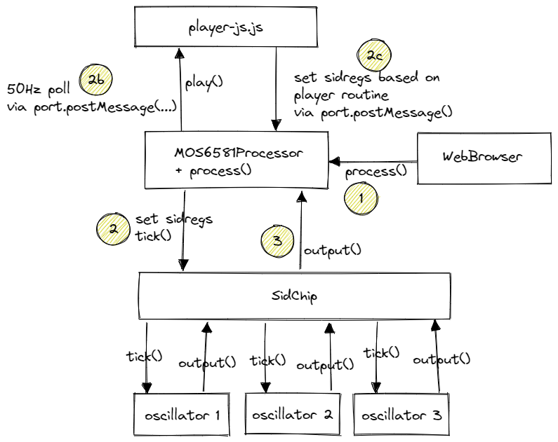

# The "SID" concept

A sid-file is basically just a binary file with a bunch of machine code and data all mixed up.

The sid file has two entry points:

1. The init address (call this to initialize the song)
2. The play address (call this 50 times pr. sec)

Thats it.

Have a look at the ghost'n'goblins sid here: https://csdb.dk/sid/?id=5757

# How I coded Ghost'n'Goblins SID in Javascript

I took the binary sid. Ran it though an online 6502 disassembler. Got the hex dump of the file.
You can find the 3 files here (binary, data and disassembly):
https://github.com/simonberinglarsen/simonberinglarsen.github.io/tree/master/ghostngoblins/assets/data

Using those files I produced the javascript player... its a long story how i actually did it - maybe I'll document it some day :)

The startup-testing done by the app compares the c64-emulated output with my javascript version.

# Audio setup

Please have a look at this drawing. Read the description below.



At startup the application sets up an AudioWorkletNode. This is the thing that constantly produces audio.

**Step 1**

The browser asks the node to fill up the audio buffer. The node will receive a buffer with a given size.

**Step 2b**

While filling in the buffer the MOS6581Processor keeps track of how "far" we are in time - when 20ms has passed the player
is called. So this means that the player is polled with freq. 50Hz.

**Step 2b**

When the player is called it will most likely end up changing some of the sid registers. The sid registers (byte array) is passed
onto the MOS6581Processor using node.postMessage([...])

**Step 2**

The node (implemented in class MOS6581Processor) will iterate through the buffer and fill in samples 1 by 1.
Foreach sample the node will set the sid-registers and ask the SidCip class for an output by first calling sid.tick().

**Step 3**

After the SidChip is ticked it will tick its 3 children (oscillators). The oscillators will generate the samples. The SidChip
takes the average of the output from the 3 oscillators. The result is set as output. That output is read by the processor and
stored in the audio buffer... that thing is repeated until the buffer has been filled up. Buffer is returned to the browser and
the whole thing repeats when the browser ask for a new buffer to be filled!

# Other Stuff

Use this for linting:

```
npx eslint ./ --ext .json --ext .js
```
